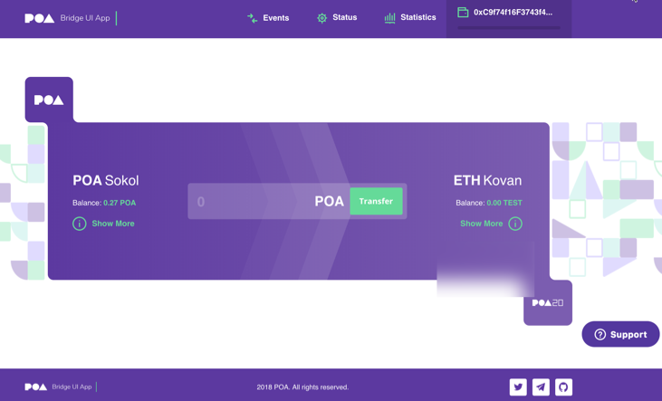
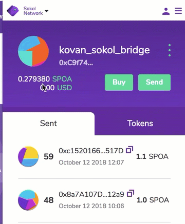

# POA Token Bridge / UI
DApp interface to transfer tokens and coins between chains.

[](https://travis-ci.org/poanetwork/bridge-ui)
[](https://gitter.im/poanetwork/poa-bridge?utm_source=badge&utm_medium=badge&utm_campaign=pr-badge&utm_content=badge)
[](https://coveralls.io/github/poanetwork/bridge-ui?branch=master)
[](https://david-dm.org/poanetwork/bridge-ui)

## Overview
Please refer to the [POA Token Bridge](../README.md) overview first of all.

The UI provides an intuitive interface for assets transfer between networks running the Bridge smart contracts. Users can connect to a web3 wallet such as [Nifty Wallet](https://github.com/poanetwork/nifty-wallet) or [MetaMask](https://metamask.io/) and complete the transfer through a web browser.

The current implementation allows for several bridge modes.

  1. `Native-to-ERC20` Coins on a Home network can be converted to ERC20-compatible tokens on a Foreign network. Coins are locked on the Home side and the corresponding amount of ERC20 tokens are minted on the Foreign side. When the operation is reversed, tokens are burnt on the Foreign side and unlocked in the Home network.
  2. `ERC20-to-ERC20` ERC20-compatible tokens on the Foreign network are locked and minted as ERC20-compatible tokens (ERC677 tokens) on the Home network. When transferred from Home to Foreign, they are burnt on the Home side and unlocked in the Foreign network. This can be considered a form of atomic swap when a user swaps the token "X" in network "A" to the token "Y" in network "B".
  3. `ERC20-to-Native` Pre-existing tokens in the Foreign network are locked and coins are minted in the Home network. In this mode, the Home network consensus engine invokes Parity's Block Reward contract to mint coins per the bridge contract request. 

  

### UI Features
- Shows daily limits in both networks
- Displays all events in both networks
- Filter events from a specific block number on both sides of the bridge
- Find a corresponding event on different sides of the bridge
- Submit a transaction from Home to Foreign network
- Submit a transaction from Foreign to Home network

### User Transactions
- Connect to the network you want to transfer coins from using a web3 wallet such as Nifty Wallet or MetaMask. This can be the Home or Foreign network. 

The wallet must be funded to cover gas costs related to the transfer. With the Native-to-ERC20 bridge, the wallet must contain the amount to transfer, and with the ERC20-to-ERC20 bridge, the wallet must contain tokens linked with the network you are transferring from.  

**Process**

- Specify the amount to send.
- Click the `Transfer` button.
- Confirm the transaction via the web3 wallet. 

The same address is used to send a coin from the Home network and receive a token on the Foreign Network. In order to send assets in the opposite direction, change the network in the web3 wallet. This changes the bridge interface to show the selected network on the left side of the bridge.




### Resources
 Some of the following resources are outdated, but provide a general sense of the UI and transactional flow.

- [Deployed URL for POA -> Ethereum Network Bridge](https://bridge.poa.net/)
- [Testnet Bridge URL](https://bridge-testnet.poa.net/)
- [Bridge UI Tutorial Videos](https://www.youtube.com/playlist?list=PLS5SEs8ZftgUqR3hVFiEXQLqE9QI8sIGz)
- [Article on the POA Bridge](https://medium.com/poa-network/cross-chain-bridges-paving-the-way-to-internet-of-blockchains-422ac94bc2e5)
- Wallet Resources
  - [MetaMask](https://consensys.zendesk.com/hc/en-us/categories/360001045692-Using-MetaMask)
  - [Nifty Wallet](https://poanet.zendesk.com/hc/en-us/articles/360008957634-Nifty-Wallet)
  - [AlphaWallet (iOS and Android)](https://alphawallet.github.io/AlphaWallet-Download-Page/)

## Getting Started

The following is an example setup using the POA Sokol testnet as the Home network, and the Ethereum Kovan testnet as the Foreign network. The instructions for the Bridge UI are identical for an `ERC20-to-ERC20` configuration, but the smart contract deployment steps will vary.

### Dependencies

- [poa-bridge-contracts](https://github.com/poanetwork/poa-bridge-contracts)
- [token-bridge](https://github.com/poanetwork/token-bridge)
- [node.js](https://nodejs.org/en/download/)
- [AlphaWallet](https://alphawallet.github.io/AlphaWallet-Download-Page/) or [Nifty Wallet](https://github.com/poanetwork/nifty-wallet) or [MetaMask](https://metamask.io/)

### Example Setup

1. Create an empty folder for setting up your bridge. In this example we call it `sokol-kovan-bridge`.
`mkdir sokol-kovan-bridge && cd sokol-kovan-bridge`  

2. Prepare temporary ETH address(es) for deployment by creating new account(s) in Nifty Wallet or MetaMask. See the [wallet resources](#resources) if you need more information on this step. This account is used:
    * for deploying bridge contracts to both networks
    * as the bridge contracts management wallet
    * as the validator's wallet address(es)

3. Fund the test account(s).
    * Fund Home account(s) using the [POA Sokol Faucet](https://faucet.poa.network/)
    * Get free Kovan Coins from the [gitter channel](https://gitter.im/kovan-testnet/faucet) or [Iracus faucet](https://github.com/kovan-testnet/faucet) for Foreign account(s). Get 5 Keth to 1 acc, and transfer from there to all other wallets if more than one account is used.

4. Deploy the Sokol <-> Kovan Bridge contracts.
    * Go to the the `sokol-kovan-bridge` folder created in step 1 and `git clone https://github.com/poanetwork/poa-bridge-contracts`
    * Follow instructions in the [POA Bridge contracts repo](https://github.com/poanetwork/poa-bridge-contracts).
    * Set the parameters in the .env file.
      * `DEPLOYMENT_ACCOUNT_PRIVATE_KEY`: Export the private key from step 2
      * `HOME_RPC_URL`=https://sokol.poa.network
      * Wallet address(es) for bridge contracts management. For testing, you can use the same address for all address values in the file. This includes:
        * `HOME_OWNER_MULTISIG`
        * `HOME_UPGRADEABLE_ADMIN_VALIDATORS`
        * `HOME_UPGRADEABLE_ADMIN_BRIDGE`
        * `FOREIGN_OWNER_MULTISIG`
        * `FOREIGN_UPGRADEABLE_ADMIN_VALIDATORS`
        * `FOREIGN_UPGRADEABLE_ADMIN_BRIDGE`
        * `VALIDATORS` _Note: Wallet address(es) for validator(s) are separated by a space. For testing, you can use the same address that was used as the bridge contracts management account._
      * `FOREIGN_RPC_URL`=https://kovan.infura.io/mew
    * When deployment is finished, check that the `bridgeDeploymentResults.json` file exists in the `poa-bridge-contracts/deploy` directory and includes the bridge contract addresses.  

5. Install and run the POA Token Bridge.
    * Got to the `sokol-kovan-bridge` folder and `git clone https://github.com/poanetwork/token-bridge`
    * Follow instructions in the [POA Token Bridge repo](https://github.com/poanetwork/token-bridge).

If successful, you will see bridge processes run when you issue a command. For example, run `npm run watcher:signature-request`

**Example NPM Output:**
```bash
[1539195000507] INFO (watcher-signature-request): Connected to redis
[1539195000545] INFO (watcher-signature-request): Connected to amqp Broker
[1539195006085] INFO (watcher-signature-request): Found 0 UserRequestForSignature events
[1539195011467] INFO (watcher-signature-request): Found 0 UserRequestForSignature events
```

**Example Docker Output:**

**Note:** The output will depend on your Docker configuration. You may need to access the container logs to view.

```bash
{"level":30,"time":1539366879816,"msg":"Connected to redis","validator":"0x..........","name":"watcher-signature-request","v":1}
{"level":30,"time":1539366879880,"msg":"Connected to amqp Broker","validator":"0x..........","name":"watcher-signature-request","v":1}
{"level":30,"time":1539366885587,"msg":"Found 0 UserRequestForSignature events","validator":"0x..........","name":"watcher-signature-request","v":1}
```

6. Keep the bridge processes running. Open a separate terminal window and go to the `sokol-kovan-bridge` folder to install and unpack this repository.

    * `git clone https://github.com/poanetwork/bridge-ui.git`  
    * `cd bridge-ui`
    * Update submodules  
`git submodule update --init --recursive` 
    * Install dependencies  
`npm install`  
_**Note**: The bridge UI configuration should be performed with an unprivileged Linux account or with the following flag `npm install --unsafe-perm`. [More information](https://docs.npmjs.com/misc/scripts#user)_
    * Create a .env file from the example file [.env.example](.env.example)  
`cp .env.example .env`  
    * Insert the addresses from the bridgeDeploymentResults.json file (from step 4) into the .env file. No other changes are needed, see [Env Parameter Details](#env-parameter-details) for information about each parameter.
`cat ../poa-bridge-contracts/deploy/bridgeDeploymentResults.json`  
```bash
    # HomeBridge address in bridgeDeploymentResults.json
    REACT_APP_HOME_BRIDGE_ADDRESS=0x.. 
    # ForeignBridge address in bridgeDeploymentResults.json
    REACT_APP_FOREIGN_BRIDGE_ADDRESS=0x..
    # https public RPC node for Foreign network
    REACT_APP_FOREIGN_HTTP_PARITY_URL=https://kovan.infura.io/mew
    # public RPC node for Home network 
    REACT_APP_HOME_HTTP_PARITY_URL=https://sokol.poa.network 
```

  * Run `npm run start`
  * Make sure your web3 wallet (Nifty Wallet, AlphaWallet or MetaMask) is funded and connected to the POA Sokol Network (see step 2)
  * Specify an amount and click `Transfer` to complete a cross-chain transaction from Sokol to Kovan

### Env Parameter Details

Name | Description
--------- | -------
REACT_APP_HOME_BRIDGE_ADDRESS | address that you have deployed at step#3. Should also be recorded at `sokol-kovan-bridge/poa-bridge-contracts/deploy/bridgeDeploymentResults.json`
REACT_APP_FOREIGN_BRIDGE_ADDRESS | address that you have deployed at step#3.
REACT_APP_FOREIGN_HTTP_PARITY_URL | http public rpc node for Foreign Network
REACT_APP_HOME_HTTP_PARITY_URL | http public rpc node for Foreign Network
REACT_APP_HOME_NATIVE_NAME | name of the home native coin
REACT_APP_HOME_NETWORK_NAME | name to be displayed for home network
REACT_APP_FOREIGN_NETWORK_NAME | name to be displayed for foreign network
REACT_APP_HOME_WITHOUT_EVENTS | `true` if home network doesn't support events
REACT_APP_FOREIGN_WITHOUT_EVENTS | `true` if foreign network doesn't support events 
REACT_APP_HOME_EXPLORER_TX_TEMPLATE | template link to transaction on home explorer. `%s` will be replaced by transaction hash
REACT_APP_FOREIGN_EXPLORER_TX_TEMPLATE | template link to transaction on foreign explorer. `%s` will be replaced by transaction hash
REACT_APP_HOME_EXPLORER_ADDRESS_TEMPLATE | template link to address on home explorer. `%s` will be replaced by address
REACT_APP_FOREIGN_EXPLORER_ADDRESS_TEMPLATE | template link to address on foreign explorer. `%s` will be replaced by address
REACT_APP_HOME_GAS_PRICE_ORACLE_URL | The URL used to get a JSON response from the gas price prediction oracle for Home network.
REACT_APP_HOME_GAS_PRICE_SPEED_TYPE | Gas Price speed (slow, standard, fast, instant)
REACT_APP_HOME_GAS_PRICE_FALLBACK | The gas price (in Wei) that is used if both the oracle and the fall back gas price specified in the Home Bridge contract are not available.
REACT_APP_HOME_GAS_PRICE_UPDATE_INTERVAL | An interval in milliseconds used to get the updated gas price value either from the oracle or from the Home Bridge contract.
REACT_APP_FOREIGN_GAS_PRICE_ORACLE_URL | The URL used to get a JSON response from the gas price prediction oracle for Foreign network.
REACT_APP_FOREIGN_GAS_PRICE_SPEED_TYPE | Gas Price speed (slow, standard, fast, instant)
REACT_APP_FOREIGN_GAS_PRICE_FALLBACK | The gas price (in Wei) that is used if both the oracle and the fall back gas price specified in the Foreign Bridge contract are not available.
REACT_APP_FOREIGN_GAS_PRICE_UPDATE_INTERVAL | An interval in milliseconds used to get the updated gas price value either from the oracle or from the Foreign Bridge contract.
REACT_APP_TITLE | The title for the bridge UI page. `%c` will be replaced by the name of the network.
REACT_APP_DESCRIPTION | The meta description for the deployed bridge page.
APP_STYLES | The set of styles to render the bridge UI page. Currently only `classic` is implemented


## Testing

To run tests

`npm run test`

To run tests with coverage

`npm run coverage`

## Contributing

See the [CONTRIBUTING](../CONTRIBUTING.md) document for contribution, testing and pull request protocol.

## License

[](https://www.gnu.org/licenses/lgpl-3.0)

This project is licensed under the GNU Lesser General Public License v3.0. See the [LICENSE](../LICENSE) file for details.
