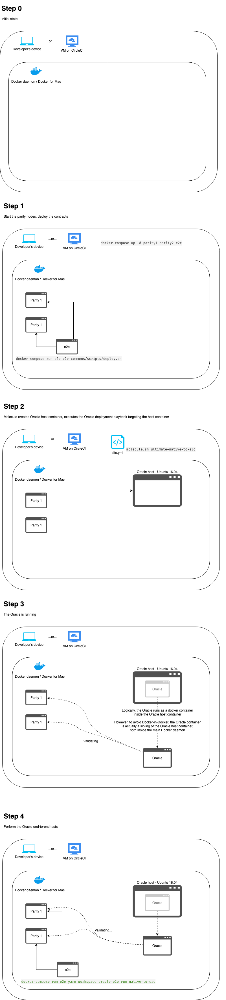

# POA TokenBridge / Ultimate E2E

Documentation regarding the Ultimate end-to-end tests.

## Overview

The ultimate e2e test scenario covers native-to-erc type of bridge.
It runs the e2e tests on components deployed using the deployment playbooks.


## Usage

### 1. Prepare the infrastructure

Run the Parity nodes, deploy the bridge contracts, deploy Oracle using the deployment playbook.

```bash
./up.sh deploy native-to-erc
```

### 2. Run the E2E tests

```
docker-compose run e2e yarn workspace oracle-e2e run native-to-erc
```

## Diagram


