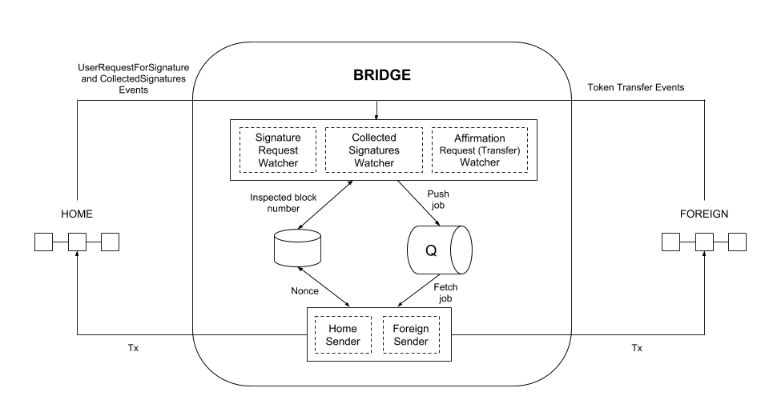

# POA TokenBridge / Oracle
Oracle responsible for listening to bridge related events and authorizing asset transfers.

## Overview
Please refer to the [POA TokenBridge](../README.md) overview first of all.

The Oracle is deployed on specified validator nodes (only nodes whose private keys correspond to addresses specified in the smart contracts) in the network. It connects to two chains via a Remote Procedure Call (RPC) and is responsible for:
- listening to events related to bridge contracts
- sending transactions to authorize asset transfers

## Architecture

### ERC20-to-Native



### Watcher
A watcher listens for a certain event and creates proper jobs in the queue. These jobs contain the transaction data (without the nonce) and the transaction hash for the related event. The watcher runs on a given frequency, keeping track of the last processed block.

If the watcher observes that the transaction data cannot be prepared, which generally means that the corresponding method of the bridge contract cannot be invoked, it inspects the contract state to identify the potential reason for failure and records this in the logs. 

There are three Watchers:
- **Signature Request Watcher**: Listens to `UserRequestForSignature` events on the Home network.
- **Collected Signatures Watcher**: Listens to `CollectedSignatures` events on the Home network.
- **Affirmation Request Watcher**: Depends on the bridge mode. 
   - `Arbitrary-Message`: Listens to `UserRequestForAffirmation` raised by the bridge contract.
   - `ERC20-to-Native`: Listens to `Transfer` events raised by the token contract.

### Sender
A sender subscribes to the queue and keeps track of the nonce. It takes jobs from the queue, extracts transaction data, adds the proper nonce, and sends it to the network.

There are two Senders:
- **Home Sender**: Sends a transaction to the `Home` network.
- **Foreign Sender**: Sends a transaction to the `Foreign` network.

### RabbitMQ

[RabbitMQ](https://www.rabbitmq.com/) is used to transmit jobs from watchers to senders.

### Redis DB

Redis is used to store the number of blocks that were already inspected by watchers, and the NOnce (Number of Operation) which was used previously by the sender to send a transaction.

For more information on the Redis/RabbitMQ requirements, see [#90](/../../issues/90). We also provide [useful commands for development](#useful-commands-for-development).

# How to Use

## Deploy the Bridge Contracts

**Note:** The following steps detail the bridge deployment process for development and testing. For deployment in a production environment we recommend using the [Bridge Deployment Playbooks](../deployment/README.md). 

1. [Deploy the bridge contracts](https://github.com/poanetwork/tokenbridge-contracts/blob/master/deploy/README.md)

2. Open `bridgeDeploymentResults.json` or copy the JSON output generated by the bridge contract deployment process.
  
#### Output examples

   `ERC20-to-Native` mode example:
   ```json
   {
       "homeBridge": {
           "address": "0x765a0d90e5a5773deacbd94b2dc941cbb163bdab",
           "deployedBlockNumber": 789987
       },
       "foreignBridge": {
           "address": "0x7ae703ea88b0545eef1f0bf8f91d5276e39be2f7",
           "deployedBlockNumber": 567765
       }
   }
   ```

## Install and configure the Oracle

1. [Initialize](../README.md#initializing-the-monorepository) the monorepository.

2. Go to the oracle sub-repository:
```
cd oracle
```

3. Create a `.env` file: 
```
cp .env.example .env
```

2. Fill in the required information using the JSON output data. Check [Configuration](../CONFIGURATION.md) to see their explanation. 

## Run the Processes

There are two options to run the TokenBridge processes:
1. Docker containers. This requires [Docker](https://docs.docker.com/install/) and [Docker Compose](https://docs.docker.com/compose/install/). If you are on Linux, it's also recommended that you [create a docker group and add your user to it](https://docs.docker.com/install/linux/linux-postinstall/), so that you can use the CLI without sudo.
2. Yarn Package Manager.

### Docker 

  - While running the bridge containers for the first time use
    ```
    env ORACLE_VALIDATOR_ADDRESS=<validator address> \
      env ORACLE_VALIDATOR_ADDRESS_PRIVATE_KEY=<validator address private key> \
      docker-compose -f docker-compose-build.yml -f docker-compose.yml up -d --build
    ``` 
  - For further launches (or in case of usage an official docker image) use
    ```
    env ORACLE_VALIDATOR_ADDRESS=<validator address> \
      env ORACLE_VALIDATOR_ADDRESS_PRIVATE_KEY=<validator address private key> \
      docker-compose up --d
    ```

All [watcher](#watcher) & [sender](#sender) services launch when `docker-compose` is called. 

Redis and RabbitMQ data are placed in `~/bridge_data` directory.
In case you need to reset your bridge or setup a new one (with different configuration) you must delete this directory to prevent old data from being read.

**Note**: To view the Docker logs:
* `chdir` to the directory containing the `docker-compose.yml` file used to run the bridge instance
* [View the logs](https://docs.docker.com/v17.09/compose/reference/logs/) : `docker-compose logs`


### Yarn

  - `redis-server` starts Redis. redis-cli ping will return a pong if Redis is running.
  - `rabbitmq-server` starts RabbitMQ. Use rabbitmqctl status to check if RabbitMQ is running.
  - `yarn watcher:signature-request`
  - `yarn watcher:collected-signatures`
  - `yarn watcher:affirmation-request`
  - `yarn sender:home`
  - `yarn sender:foreign`

### Build the image without running the oracle

To build the image change the directory:
```
cd oracle
```

And run the docker composer:
```
docker-compose -f docker-compose-build.yml build
``` 

## Rollback the Last Processed Block in Redis

If the bridge does not handle an event properly (i.e. a transaction stalls due to a low gas price), the Redis DB can be rolled back. You must identify which watcher needs to re-run. For example, if the validator signatures were collected but the transaction with signatures was not sent to the Foreign network, the `collected-signatures` watcher must look at the block where the corresponding `CollectedSignatures` event was raised.

Execute this command in the bridge root directory:

for local installation:
```shell
bash ./reset-lastBlock.sh <watcher> <block num>
```
for Docker installation:
```shell
docker-compose exec bridge_affirmation bash ./reset-lastBlock.sh <watcher> <block num>
```
where the _watcher_ could be one of:

- `signature-request`
- `collected-signatures`
- `affirmation-request`

## Configuration parameters

Please refer to [Configuration](../CONFIGURATION.md).

## Useful Commands for Development

### RabbitMQ
Command | Description
--- | ---
`rabbitmqctl list_queues` | List all queues
`rabbitmqctl purge_queue home` | Remove all messages from `home` queue
`rabbitmqctl status` | check if rabbitmq server is currently running  
`rabbitmq-server`    | start rabbitMQ server  

### Redis
Use `redis-cli`

Command | Description
--- | ---
`KEYS *` | Returns all keys
`SET signature-request:lastProcessedBlock 1234` | Set key to hold the string value.
`GET signature-request:lastProcessedBlock` | Get the key value.
`DEL signature-request:lastProcessedBlock` | Removes the specified key.
`FLUSHALL` | Delete all the keys in all existing databases.
`redis-cli ping`     | check if redis is running.  
`redis-server`       | start redis server.  

## Testing

```bash
yarn test
```

### E2E tests

See the [E2E README](../oracle-e2e/README.md) for instructions. 

*Notice*: for docker-based installations do not forget to add `docker-compose exec bridge_affirmation` before the test commands listed below.

### ERC20-to-Native Mode Testing

- To deposit from a Foreign to a Home contract run `node scripts/erc20_to_native/sendForeign.js <tx num>`.

- To make withdrawal to Home from a Foreign contract run `node scripts/erc20_to_native/sendHome.js <tx num>`.

### Configuration parameters for testing

| Variable | Description |
|-------------------------------------|------------------------------------------------------------------------------------------------------------------------------------------------------------------------------------------------------------------------------------------------------------------------------------------------------------------------------------------------------------------------------------------------------|
| `COMMON_HOME_RPC_URL` | The HTTPS URL(s) used to communicate to the RPC nodes in the Home network. |
| `COMMON_FOREIGN_RPC_URL` | The HTTPS URL(s) used to communicate to the RPC nodes in the Foreign network. |
| `USER_ADDRESS` | An account - the current owner of coins/tokens. |
| `USER_ADDRESS_PRIVATE_KEY` | A private key belonging to the account. |
| `COMMON_HOME_BRIDGE_ADDRESS` | Address of the bridge in the Home network to send transactions. |
| `HOME_MIN_AMOUNT_PER_TX` | Value (in _eth_ or tokens) to be sent in one transaction for the Home network. This should be greater than or equal to the value specified in the `tokenbridge-contracts/deploy/.env` file. The default value in that file is 500000000000000000, which is equivalent to 0.5. |
| `HOME_TEST_TX_GAS_PRICE` | The gas price (in Wei) that is used to send transactions in the Home network . |
| `COMMON_FOREIGN_BRIDGE_ADDRESS` | Address of the bridge in the Foreign network to send transactions. |
| `FOREIGN_MIN_AMOUNT_PER_TX` | Value (in _eth_ or tokens) to be sent in one transaction for the Foreign network. This should be greater than or equal to the value specified in the `tokenbridge-contracts/deploy/.env` file. The default value in that file is 500000000000000000, which is equivalent to 0.5. |
| `FOREIGN_TEST_TX_GAS_PRICE` | The gas price (in Wei) that is used to send transactions in the Foreign network . |

## Contributing

See the [CONTRIBUTING](../CONTRIBUTING.md) document for contribution, testing and pull request protocol.

## License

[](https://www.gnu.org/licenses/lgpl-3.0)

This project is licensed under the GNU Lesser General Public License v3.0. See the [LICENSE](../LICENSE) file for details.
