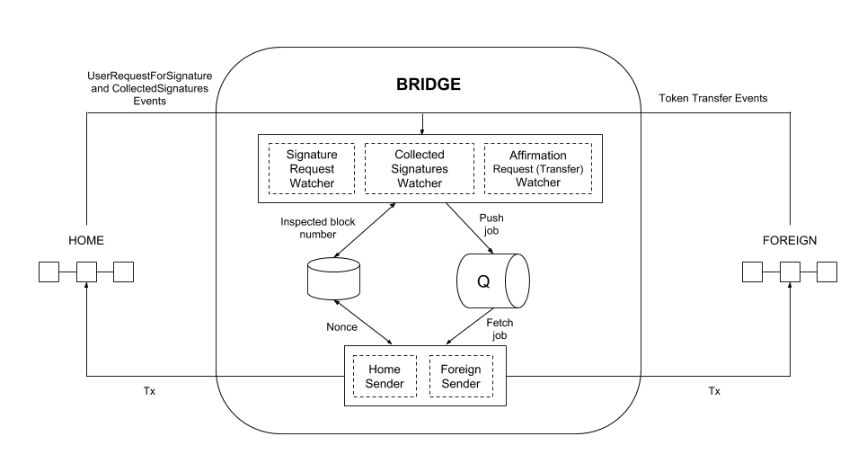

# POA TokenBridge

[](https://travis-ci.org/poanetwork/token-bridge)
[](https://gitter.im/poanetwork/poa-bridge?utm_source=badge&utm_medium=badge&utm_campaign=pr-badge&utm_content=badge)

The TokenBridge is deployed on specified validator nodes (only nodes whose private keys correspond to addresses specified in the smart contracts) in the network. It connects to two chains via a Remote Procedure Call (RPC) and is responsible for:
- listening to events related to bridge contracts
- sending transactions to authorize asset transfers

Following is an overview of the TokenBridge and [instructions for getting started](#how-to-use).

## POA General Bridge Overview

A POA Bridge allows users to transfer assets between two chains in the Ethereum ecosystem. It is composed of several elements located in different POA Network repositories:

**Bridge Elements**
1. The TokenBridge contained in this repository.
2. [Solidity smart contracts](https://github.com/poanetwork/poa-bridge-contracts). Used to manage bridge validators, collect signatures, and confirm asset relay and disposal.
3. [Bridge UI Application](https://github.com/poanetwork/bridge-ui). A DApp interface to transfer tokens and coins between chains.
4. [Bridge Monitor](https://github.com/poanetwork/bridge-monitor). A tool for checking balances and unprocessed events in bridged networks.
5. [Bridge Deployment Playbooks](https://github.com/poanetwork/deployment-bridge). Manages configuration instructions for remote deployments.

## Network Definitions

 Bridging occurs between two networks.

 * **Home** - or **Native** - is a network with fast and inexpensive operations. All bridge operations to collect validator confirmations are performed on this side of the bridge.

* **Foreign** can be any chain; generally it refers to the Ethereum mainnet. 

## Operational Modes

The POA TokenBridge provides three operational modes:

- [x] `Native-to-ERC20` **Coins** on a Home network can be converted to ERC20-compatible **tokens** on a Foreign network. Coins are locked on the Home side and the corresponding amount of ERC20 tokens are minted on the Foreign side. When the operation is reversed, tokens are burnt on the Foreign side and unlocked in the Home network. **More Information: [POA-to-POA20 Bridge](https://medium.com/poa-network/introducing-poa-bridge-and-poa20-55d8b78058ac)**
- [x] `ERC20-to-ERC20` ERC20-compatible tokens on the Foreign network are locked and minted as ERC20-compatible tokens (ERC677 tokens) on the Home network. When transferred from Home to Foreign, they are burnt on the Home side and unlocked in the Foreign network. This can be considered a form of atomic swap when a user swaps the token "X" in network "A" to the token "Y" in network "B". **More Information: [ERC20-to-ERC20](https://medium.com/poa-network/introducing-the-erc20-to-erc20-tokenbridge-ce266cc1a2d0)**
- [x] `ERC20-to-Native`: Pre-existing **tokens** in the Foreign network are locked and **coins** are minted in the `Home` network. In this mode, the Home network consensus engine invokes [Parity's Block Reward contract](https://wiki.parity.io/Block-Reward-Contract.html) to mint coins per the bridge contract request. **More Information: [xDai Chain](https://medium.com/poa-network/poa-network-partners-with-makerdao-on-xdai-chain-the-first-ever-usd-stable-blockchain-65a078c41e6a)**

## Architecture

### Native-to-ERC20


### ERC20-to-ERC20 and ERC20-to-Native



### Watcher
A watcher listens for a certain event and creates proper jobs in the queue. These jobs contain the transaction data (without the nonce) and the transaction hash for the related event. The watcher runs on a given frequency, keeping track of the last processed block.

If the watcher observes that the transaction data cannot be prepared, which generally means that the corresponding method of the bridge contract cannot be invoked, it inspects the contract state to identify the potential reason for failure and records this in the logs. 

There are three Watchers:
- **Signature Request Watcher**: Listens to `UserRequestForSignature` events on the Home network.
- **Collected Signatures Watcher**: Listens to `CollectedSignatures` events on the Home network.
- **Affirmation Request Watcher**: Depends on the bridge mode. 
   - `Native-to-ERC20`: Listens to `UserRequestForAffirmation` raised by the bridge contract.
   - `ERC20-to-ERC20` and `ERC20-to-Native`: Listens to `Transfer` events raised by the token contract.

### Sender
A sender subscribes to the queue and keeps track of the nonce. It takes jobs from the queue, extracts transaction data, adds the proper nonce, and sends it to the network.

There are two Senders:
- **Home Sender**: Sends a transaction to the `Home` network.
- **Foreign Sender**: Sends a transaction to the `Foreign` network.

### RabbitMQ

[RabbitMQ](https://www.rabbitmq.com/) is used to transmit jobs from watchers to senders.

### Redis DB

Redis is used to store the number of blocks that were already inspected by watchers, and the NOnce (Number of Operation) which was used previously by the sender to send a transaction.

For more information on the Redis/RabbitMQ requirements, see [#90](/../../issues/90). We also provide [useful commands for development](#useful-commands-for-development).

# How to Use

## Installation and Deployment

**Note:** The following steps detail the bridge deployment process for development and testing. For deployment in a production environment we recommend using the [Bridge Deployment Playbooks](https://github.com/poanetwork/deployment-bridge/tree/master/bridge-nodejs). 

#### Deploy the Bridge Contracts

1. [Deploy the bridge contracts](https://github.com/poanetwork/poa-bridge-contracts/blob/master/deploy/README.md)

2. Open `bridgeDeploymentResults.json` or copy the JSON output generated by the bridge contract deployment process.
  
   `Native-to-ERC20` mode example:
   ```json
   {
       "homeBridge": {
           "address": "0xc60daff55ec5b5ce5c3d2105a77e287ff638c35e",
           "deployedBlockNumber": 123321
       },
       "foreignBridge": {
           "address": "0x3f5ce5fbfe3e9af3971dd833d26ba9b5c936f0be",
           "deployedBlockNumber": 456654,
           "erc677": {
               "address": "0x41a29780309dc2582f080f6af89953be3435679a"
           }
       }
   }
   ```

   `ERC20-to-ERC20` mode example:
   ```json
   {
       "homeBridge": {
           "address": "0x765a0d90e5a5773deacbd94b2dc941cbb163bdab",
           "deployedBlockNumber": 789987,
           "erc677": {
               "address": "0x269f57f5ae5421d084686f9e353f5b7ee6af54c2"
           }
       },
       "foreignBridge": {
           "address": "0x7ae703ea88b0545eef1f0bf8f91d5276e39be2f7",
           "deployedBlockNumber": 567765
       }
   }
   ```

## Configuration

1. Create a `.env` file: `cp .env.example .env`

2. Fill in the required information using the JSON output data. Check the tables with the [set of parameters](#configuration-parameters) below to see their explanation. 

## Run the Processes

There are two options to run the TokenBridge processes:
1. Docker containers. This requires [Docker](https://docs.docker.com/install/) and [Docker Compose](https://docs.docker.com/compose/install/). If you are on Linux, it's also recommended that you [create a docker group and add your user to it](https://docs.docker.com/install/linux/linux-postinstall/), so that you can use the CLI without sudo.
2. NodeJs Package Manager (NPM).

### Docker 

  - While running the bridge containers for the first time use `VALIDATOR_ADDRESS=<validator address> VALIDATOR_ADDRESS_PRIVATE_KEY=<validator address private key> docker-compose up -d --build` 
  - For further launches use `VALIDATOR_ADDRESS=<validator address>  VALIDATOR_ADDRESS_PRIVATE_KEY=<validator address private key> docker-compose  up  --detach`

All [watcher](#watcher) & [sender](#sender) services launch when `docker-compose` is called. 

**Note**: To view the Docker logs:
* `chdir` to the directory containing the `docker-compose.yml` file used to run the bridge instance
* [View the logs](https://docs.docker.com/v17.09/compose/reference/logs/) : `docker-compose logs`


### NPM

  - `redis-server` starts Redis. redis-cli ping will return a pong if Redis is running.
  - `rabbitmq-server` starts RabbitMQ. Use rabbitmqctl status to check if RabbitMQ is running.
  - `npm run watcher:signature-request`
  - `npm run watcher:collected-signatures`
  - `npm run watcher:affirmation-request`
  - `npm run sender:home`
  - `npm run sender:foreign`

### Bridge UI

See the [Bridge UI installation instructions](https://github.com/poanetwork/bridge-ui/) to configure and use the optional Bridge UI.

## Rollback the Last Processed Block in Redis

If the bridge does not handle an event properly (i.e. a transaction stalls due to a low gas price), the Redis DB can be rolled back. You must identify which watcher needs to re-run. For example, if the validator signatures were collected but the transaction with signatures was not sent to the Foreign network, the `collected-signatures` watcher must look at the block where the corresponding `CollectedSignatures` event was raised.

Execute this command in the bridge root directory:

for NPM installation:
```shell
bash ./reset-lastBlock.sh <watcher> <block num>
```
for Docker installation:
```shell
docker-compose exec bridge_affirmation bash ./reset-lastBlock.sh <watcher> <block num>
```
where the _watcher_ could be one of:

- `signature-request`
- `collected-signatures`
- `affirmation-request`

## Configuration parameters

| Variable | Description | Values |
|-------------------------------------|------------------------------------------------------------------------------------------------------------------------------------------------------------------------------------------------------------------------------------------------------------------------------------------------------------------------------------------------------------------------------------------------------|------------------------------------------|
| `BRIDGE_MODE` | The bridge mode. The bridge starts listening to a different set of events based on this parameter. | `NATIVE_TO_ERC` / `ERC_TO_ERC` / `ERC_TO_NATIVE` |
| `HOME_RPC_URL` | The HTTPS URL(s) used to communicate to the RPC nodes in the Home network. Several URLs can be specified, delimited by spaces. If the connection to one of these nodes is lost the next URL is used for connection. | URL(s) |
| `HOME_BRIDGE_ADDRESS` | The address of the bridge contract address in the Home network. It is used to listen to events from and send validators' transactions to the Home network. | hexidecimal beginning with "0x" |
| `HOME_POLLING_INTERVAL` | The interval in milliseconds used to request the RPC node in the Home network for new blocks. The interval should match the average production time for a new block. | integer |
| `FOREIGN_RPC_URL` | The HTTPS URL(s) used to communicate to the RPC nodes in the Foreign network. Several URLs can be specified, delimited by spaces. If the connection to one of these nodes is lost the next URL is used for connection. | URL(s) |
| `FOREIGN_BRIDGE_ADDRESS` | The  address of the bridge contract address in the Foreign network. It is used to listen to events from and send validators' transactions to the Foreign network. | hexidecimal beginning with "0x" |
| `ERC20_TOKEN_ADDRESS` | Used with the `ERC_TO_ERC` bridge mode, this parameter specifies the ERC20-compatible token contract address. The token contract address is used to identify transactions that transfer tokens to the Foreign Bridge account address. Omit this parameter with other bridge modes. | hexidecimal beginning with "0x" |
| `FOREIGN_POLLING_INTERVAL` | The interval in milliseconds used to request the RPC node in the Foreign network for new blocks. The interval should match the average production time for a new block. | integer |
| `HOME_GAS_PRICE_ORACLE_URL` | The URL used to get a JSON response from the gas price prediction oracle for the Home network. The gas price provided by the oracle is used to send the validator's transactions to the RPC node. Since it is assumed that the Home network has a predefined gas price (e.g. the gas price in the Core of POA.Network is `1 GWei`), the gas price oracle parameter can be omitted for such networks. | URL |
| `HOME_GAS_PRICE_SPEED_TYPE` | Assuming the gas price oracle responds with the following JSON structure: `{"fast": 20.0, "block_time": 12.834, "health": true, "standard": 6.0, "block_number": 6470469, "instant": 71.0, "slow": 1.889}`, this parameter specifies the desirable transaction speed. The speed type can be omitted when `HOME_GAS_PRICE_ORACLE_URL` is not used. | `instant` / `fast` / `standard` / `slow` |
| `HOME_GAS_PRICE_FALLBACK` | The gas price (in Wei) that is used if both the oracle and the fall back gas price specified in the Home Bridge contract are not available. | integer |
| `HOME_GAS_PRICE_UPDATE_INTERVAL` | An interval in milliseconds used to get the updated gas price value either from the oracle or from the Home Bridge contract. | integer |
| `FOREIGN_GAS_PRICE_ORACLE_URL` | The URL used to get a JSON response from the gas price prediction oracle for the Foreign network. The provided gas price is used to send the validator's transactions to the RPC node. If the Foreign network is Ethereum Foundation mainnet, the oracle URL can be: https://gasprice.poa.network. Otherwise this parameter can be omitted. | URL |
| `FOREIGN_GAS_PRICE_SPEED_TYPE` | Assuming the gas price oracle responds with the following JSON structure: `{"fast": 20.0, "block_time": 12.834, "health": true, "standard": 6.0, "block_number": 6470469, "instant": 71.0, "slow": 1.889}`, this parameter specifies the desirable transaction speed. The speed type can be omitted when `FOREIGN_GAS_PRICE_ORACLE_URL`is not used. | `instant` / `fast` / `standard` / `slow` |
| `FOREIGN_GAS_PRICE_FALLBACK` | The gas price (in Wei) used if both the oracle and fall back gas price specified in the Foreign Bridge contract are not available. | integer |
| `FOREIGN_GAS_PRICE_UPDATE_INTERVAL` | The interval in milliseconds used to get the updated gas price value either from the oracle or from the Foreign Bridge contract. | integer |
| `VALIDATOR_ADDRESS_PRIVATE_KEY` | The private key of the bridge validator used to sign confirmations before sending transactions to the bridge contracts. The validator account is calculated automatically from the private key. Every bridge instance (set of watchers and senders) must have its own unique private key. The specified private key is used to sign transactions on both sides of the bridge. | hexidecimal without "0x" |
| `HOME_START_BLOCK` | The block number in the Home network used to start watching for events when the bridge instance is run for the first time. Usually this is the same block where the Home Bridge contract is deployed. If a new validator instance is being deployed for an existing set of validators, the block number could be the latest block in the chain. | integer |
| `FOREIGN_START_BLOCK` | The block number in the Foreign network used to start watching for events when the bridge instance runs for the first time. Usually this is the same block where the Foreign Bridge contract was deployed to. If a new validator instance is being deployed for an existing set of validators, the block number could be the latest block in the chain. | integer |
| `QUEUE_URL` | RabbitMQ URL used by watchers and senders to communicate to the message queue. Typically set to: `amqp://127.0.0.1`. | local URL |
| `REDIS_URL` | Redis DB URL used by watchers and senders to communicate to the database. Typically set to: `redis://127.0.0.1:6379`. | local URL |
| `REDIS_LOCK_TTL` | Threshold in milliseconds for locking a resource in the Redis DB. Until the threshold is exceeded, the resource is unlocked. Usually it is `1000`. | integer |
| `ALLOW_HTTP` | **Only use in test environments - must be omitted in production environments.**. If this parameter is specified and set to `yes`, RPC URLs can be specified in form of HTTP links. A warning that the connection is insecure will be written to the logs. | `yes` / `no` |
| `LOG_LEVEL` | Set the level of details in the logs. | `trace` / `debug` / `info` / `warn` / `error` / `fatal` |
| `MAX_PROCESSING_TIME` | The workers processes will be killed if this amount of time (in milliseconds) is ellapsed before they finish processing. It is recommended to set this value to 4 times the value of the longest polling time (set with the `HOME_POLLING_INTERVAL` and `FOREIGN_POLLING_INTERVAL` variables). To disable this, set the time to 0. | integer |

## Useful Commands for Development

### RabbitMQ
Command | Description
--- | ---
`rabbitmqctl list_queues` | List all queues
`rabbitmqctl purge_queue home` | Remove all messages from `home` queue
`rabbitmqctl status` | check if rabbitmq server is currently running  
`rabbitmq-server`    | start rabbitMQ server  

### Redis
Use `redis-cli`

Command | Description
--- | ---
`KEYS *` | Returns all keys
`SET signature-request:lastProcessedBlock 1234` | Set key to hold the string value.
`GET signature-request:lastProcessedBlock` | Get the key value.
`DEL signature-request:lastProcessedBlock` | Removes the specified key.
`FLUSHALL` | Delete all the keys in all existing databases.
`redis-cli ping`     | check if redis is running.  
`redis-server`       | start redis server.  

## Testing

```bash
npm test
```

### E2E tests

See the [E2E README](/e2e) for instructions. 

*Notice*: for docker-based installations do not forget to add `docker-compose exec bridge_affirmation` before the test commands listed below.

### Native-to-ERC20 Mode Testing

When running the processes, the following commands can be used to test functionality.

- To send deposits to a home contract run `node scripts/native_to_erc20/sendHome.js <tx num>`, where `<tx num>` is how many tx will be sent out to deposit.

- To send withdrawals to a foreign contract run `node scripts/native_to_erc20/sendForeign.js <tx num>`, where `<tx num>` is how many tx will be sent out to withdraw.

### ERC20-to-ERC20 Mode Testing

- To deposit from a Foreign to a Home contract run `node scripts/erc20_to_erc20/sendForeign.js <tx num>`.

- To make withdrawal to Home from a Foreign contract run `node scripts/erc20_to_erc20/sendHome.js <tx num>`.

### ERC20-to-Native Mode Testing

- To deposit from a Foreign to a Home contract run `node scripts/erc20_to_native/sendForeign.js <tx num>`.

- To make withdrawal to Home from a Foreign contract run `node scripts/erc20_to_native/sendHome.js <tx num>`.

### Configuration parameters for testing

| Variable | Description |
|-------------------------------------|------------------------------------------------------------------------------------------------------------------------------------------------------------------------------------------------------------------------------------------------------------------------------------------------------------------------------------------------------------------------------------------------------|
| `HOME_RPC_URL` | The HTTPS URL(s) used to communicate to the RPC nodes in the Home network. |
| `FOREIGN_RPC_URL` | The HTTPS URL(s) used to communicate to the RPC nodes in the Foreign network. |
| `USER_ADDRESS` | An account - the current owner of coins/tokens. |
| `USER_ADDRESS_PRIVATE_KEY` | A private key belonging to the account. |
| `HOME_BRIDGE_ADDRESS` | Address of the bridge in the Home network to send transactions. |
| `HOME_MIN_AMOUNT_PER_TX` | Value (in _eth_ or tokens) to be sent in one transaction for the Home network. This should be greater than or equal to the value specified in the `poa-bridge-contracts/deploy/.env` file. The default value in that file is 500000000000000000, which is equivalent to 0.5. |
| `HOME_TEST_TX_GAS_PRICE` | The gas price (in Wei) that is used to send transactions in the Home network . |
| `FOREIGN_BRIDGE_ADDRESS` | Address of the bridge in the Foreign network to send transactions. |
| `FOREIGN_MIN_AMOUNT_PER_TX` | Value (in _eth_ or tokens) to be sent in one transaction for the Foreign network. This should be greater than or equal to the value specified in the `poa-bridge-contracts/deploy/.env` file. The default value in that file is 500000000000000000, which is equivalent to 0.5. |
| `FOREIGN_TEST_TX_GAS_PRICE` | The gas price (in Wei) that is used to send transactions in the Foreign network . |

## Contributing

See the [CONTRIBUTING](CONTRIBUTING.md) document for contribution, testing and pull request protocol.

## License

[](https://www.gnu.org/licenses/lgpl-3.0)

This project is licensed under the GNU Lesser General Public License v3.0. See the [LICENSE](LICENSE) file for details.

## References

* [Additional Documentation](https://forum.poa.network/c/tokenbridge)
* [POA Bridge FAQ](https://poanet.zendesk.com/hc/en-us/categories/360000349273-POA-Bridge)

